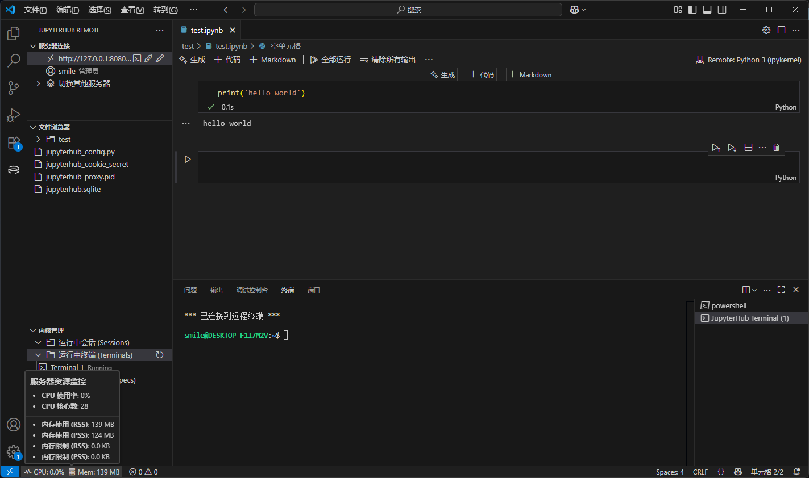
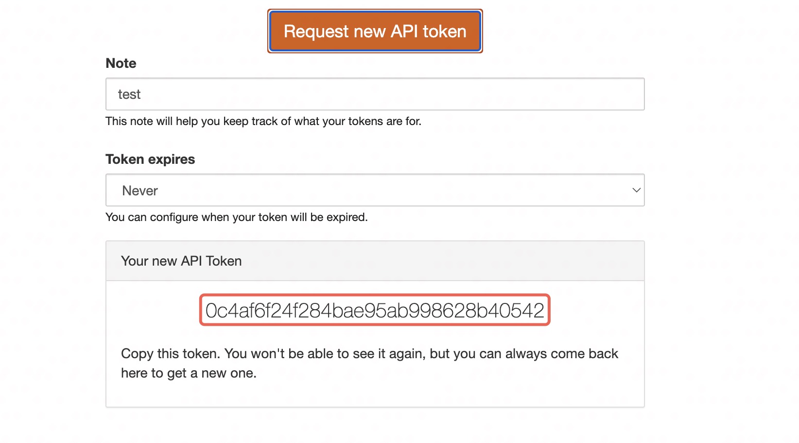

# JupyterHub Remote Extension

VS Code 扩展：连接远程 JupyterHub / Jupyter Server，在 VS Code 中浏览与编辑远程文件、管理终端与内核，并展示资源监控。
使用Jupyterhub REST API

## 功能

- 连接 JupyterHub（API Token 认证），支持自动/手动启动单用户服务器
- 支持保存多服务器（最近连接列表），可随时切换/重新配置
- 远程文件浏览与常用文件操作（新建/删除/重命名/上传/下载）
- 远程终端（Jupyter Server terminals WebSocket）
- 内核/会话管理（查看、停止、重启、中断）
- 状态栏资源监控（CPU/内存/磁盘；依赖服务器侧 `/api/metrics/v1` 插件）
- 支持按 Hub URL 透传 `user_options`（profile/资源参数）

## 示例



## 兼容性

- VS Code >= 1.85
- Node.js >= 18（开发/构建）
- JupyterHub 4.x / 5.x（REST spawn + Hub API）
- 需要 Hub 启用 API Token

## 安装

### 从 Marketplace / VSIX

（发布后补充 Marketplace 链接）

本地安装 VSIX：

```bash
code --install-extension jupyterhub-remote-extension-*.vsix
```

### 从源码构建

```bash
npm install
npm run compile
vsce package
code --install-extension jupyterhub-remote-extension-*.vsix
```

## 使用

1. 打开命令面板：
   - macOS：`Cmd+Shift+P`
   - Windows/Linux：`Ctrl+Shift+P`
2. 运行 `JupyterHub: 连接到 JupyterHub 服务器`
3. 输入 Hub URL 与 API Token（Token 存在 VS Code Secret Storage）
   - 可直接粘贴包含路径的地址（如 `https://host/user/<name>/lab`），扩展会自动规范化为 Hub Base URL（如 `https://host` 或 `https://host/<prefix>`）
   - Token 获取：访问 `https://<host>/hub/token` 新建 Token

1. 若服务器未运行且启用自动启动，会按配置透传 options 启动

### 常用命令

- `JupyterHub: 连接到 JupyterHub 服务器`：新增/切换到某个 Hub
- `JupyterHub: 断开服务器连接`：断开当前连接
- `JupyterHub: 重新配置服务器`：修改当前 Hub 的 URL/Token 等
- `JupyterHub: 删除服务器`：从最近列表移除，并清理该服务器的 Token/profile/user_options
- `JupyterHub: 显示内核管理面板`：查看/停止/重启/中断内核
- 点击底部状态栏的资源监控项，可打开详情（CPU/内存/磁盘）

### 资源监控前置条件

需要在服务器侧安装并启用 `jupyter-resource-usage`，扩展会通过 `/api/metrics/v1` 拉取指标：

- https://github.com/jupyter-server/jupyter-resource-usage

### Profile / user_options 配置

JupyterHub 不提供 profiles JSON API，本扩展通过设置让用户指定并按 Hub URL 记忆。

```json
{
  "jupyterhub.profileByServer": {
    "https://hub.example.com": "kai-fa"
  },
  "jupyterhub.userOptionsByServer": {
    "https://hub.example.com": {
      "mem_limit": "8G",
      "cpu_limit": 4
    }
  }
}
```

启动时会合并后 `POST /hub/api/users/{user}/server`。

## 配置项

| 配置 | 说明 | 默认 |
|---|---|---|
| `jupyterhub.serverUrl` | 默认 Hub URL | `""` |
| `jupyterhub.verifySSL` | 是否验证 SSL | `true` |
| `jupyterhub.maxRetries` | API 最大重试次数 | `3` |
| `jupyterhub.autoStartServer` | 连接时自动启动 server | `true` |
| `jupyterhub.profileByServer` | Hub URL → profile key | `{}` |
| `jupyterhub.userOptionsByServer` | Hub URL → user_options | `{}` |
| `jupyterhub.refreshInterval.*` | 各视图刷新间隔（秒） | 见设置 |
| `jupyterhub.debug` | 输出调试日志 | `false` |
| `jupyterhub.allowInsecureTokenStorage` | 允许将 Token 明文写入 Settings JSON（不安全，不建议） | `false` |
| `jupyterhub.tokenByServer` | Hub URL → Token（仅在开启 allowInsecureTokenStorage 生效） | `{}` |

## 开发

```bash
npm install
npm run watch   # tsc watch
npm run lint
```

## License

Apache-2.0
