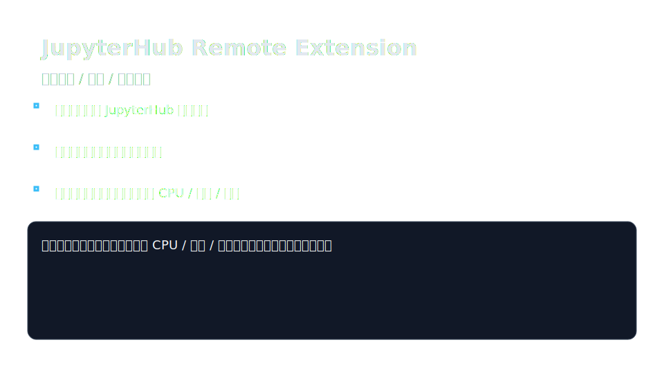

# JupyterHub Remote Extension

VS Code 扩展：连接远程 JupyterHub / Jupyter Server，在 VS Code 中浏览与编辑远程文件、管理终端与内核，并展示资源监控。
使用 JupyterHub REST API，用于无法开启 SSH 或生产无法暴露 SSH 等场景。



> 无法查看上方 SVG 时，可参考示意内容：深色背景的卡片展示了扩展的主要流程与能力，包括命令面板输入连接命令、保存并快速切换多个服务器、自动启动单用户服务器，以及在状态栏显示 CPU / 内存 / 磁盘的已用与总量；底部文字强调连接成功后即可在资源监控、远程文件与终端中查看和操作资源。

## 功能

- 连接 JupyterHub（API Token 认证），支持自动/手动启动单用户服务器
- 保存多个服务器配置，命令面板内随时切换
- 远程文件浏览与常用文件操作（新建/删除/重命名/上传/下载）
- 远程终端（Jupyter Server terminals WebSocket）
- 内核/会话管理（查看、停止、重启、中断）
- 状态栏资源监控（依赖服务器侧 `/api/metrics/v1` 插件），展示 CPU / 内存 / 磁盘已用与总量
- 支持按 Hub URL 透传 `user_options`（profile/资源参数），记住并自动应用

## 兼容性

- VS Code >= 1.85
- Node.js >= 18（开发/构建）
- JupyterHub 4.x / 5.x（REST spawn + Hub API）
- 需要 Hub 启用 API Token

## 安装

### 从 Marketplace / VSIX

（发布后补充 Marketplace 链接）

本地安装 VSIX：

```bash
code --install-extension jupyterhub-remote-extension-*.vsix
```

### 从源码构建

```bash
npm install
npm run compile
vsce package
code --install-extension jupyterhub-remote-extension-*.vsix
```

## 使用

1. 打开命令面板（Windows/Linux: `Ctrl+Shift+P`，macOS: `Cmd+Shift+P`），运行 `JupyterHub: 连接到 JupyterHub 服务器`
2. 输入 Hub URL 与 API Token（Token 保存在 VS Code Secret Storage，可保存多个服务器并下次直接选择）
3. 如果启用自动启动，未运行的单用户服务器会自动拉起，并按配置透传 profile / `user_options`
4. 连接成功后可在资源监控看到 CPU/内存/磁盘用量，在资源浏览器里打开远程文件、启动终端或管理内核

### 快速切换与常用操作

- 再次打开命令面板选择 `JupyterHub: 连接到 JupyterHub 服务器`，可在历史服务器列表中快速切换
- 资源视图中可执行新建、删除、重命名、上传、下载等文件操作
- 状态栏会实时显示 CPU / 内存 / 磁盘使用情况，方便确认资源占用

### Profile / user_options 配置

JupyterHub 不提供 profiles JSON API，本扩展通过设置让用户指定并按 Hub URL 记忆。

```json
{
  "jupyterhub.profileByServer": {
    "https://hub.example.com": "kai-fa"
  },
  "jupyterhub.userOptionsByServer": {
    "https://hub.example.com": {
      "mem_limit": "8G",
      "cpu_limit": 4
    }
  }
}
```

启动时会合并后 `POST /hub/api/users/{user}/server`。

## 配置项

| 配置 | 说明 | 默认 |
|---|---|---|
| `jupyterhub.serverUrl` | 默认 Hub URL | `""` |
| `jupyterhub.verifySSL` | 是否验证 SSL | `true` |
| `jupyterhub.maxRetries` | API 最大重试次数 | `3` |
| `jupyterhub.autoStartServer` | 连接时自动启动 server | `true` |
| `jupyterhub.profileByServer` | Hub URL → profile key | `{}` |
| `jupyterhub.userOptionsByServer` | Hub URL → user_options | `{}` |
| `jupyterhub.refreshInterval.*` | 各视图刷新间隔（秒） | 见设置 |
| `jupyterhub.debug` | 输出调试日志 | `false` |

## 开发

```bash
npm install
npm run watch   # tsc watch
npm run lint
```

按 `F5` 启动 Extension Development Host。


## License

Apache-2.0
